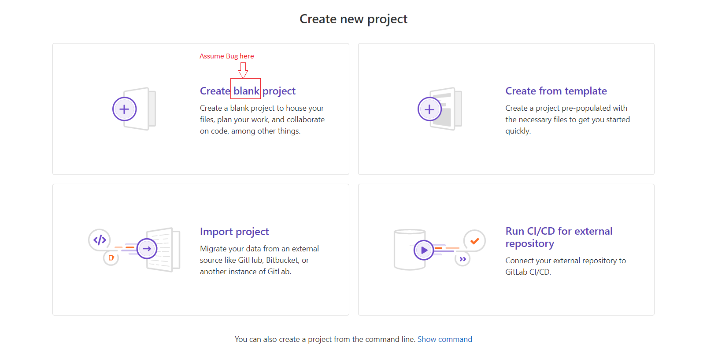

## Summary (Summarize the bug encountered concisely)
Bug on the "Create new project" page, where the title displays a typo, saying "Create black project" instead of the correct "Create blank project."

## Steps to reproduce     
Open a browser.
Navigate to GitLab Sign-in.
Log in to the account.
Land on the "Projects" page.
Click the "New Project" button.
Observe the heading in the first box on the "Create new project" page.
   

## What is the current bug behavior?
The bug is a typo, prompting the user to create a "black" project.
     

## What is the expected correct behavior?
The user is expected to create a "blank" project.

     
## Relevant logs and/or screenshots
Current Title: Create black project

Expected Title: Create blank project

## Possible fixes
The fix involves a simple spelling correction, changing "black" to "blank."
or
<h3 class="gl-font-size-h2 gl-reset-color">
  Create blank project
</h3>

## Whom do you report/ Assign To/ Tags
/label ~bug ~typo ~easy-to-fix
/cc @project-manager
/assign @qa-tester
cc @testing-project-05-manager

## Priority
The severity of the bug is low. It does not hinder system processes, so it is given a priority of Minor.
      
